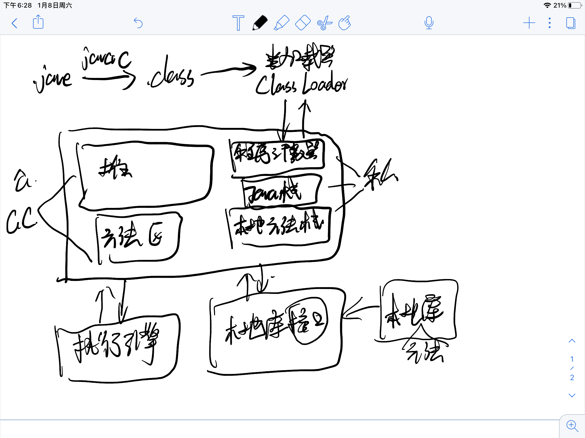
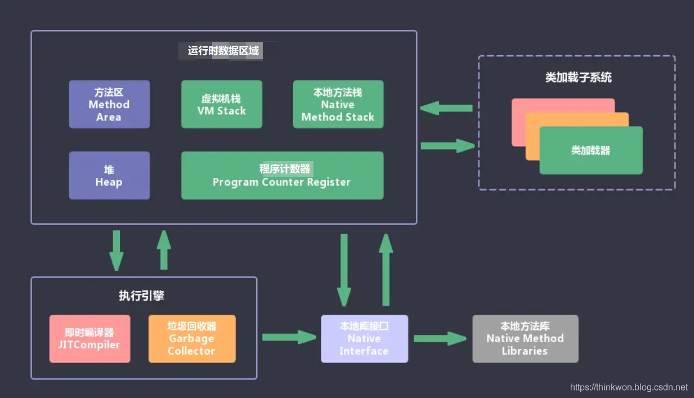
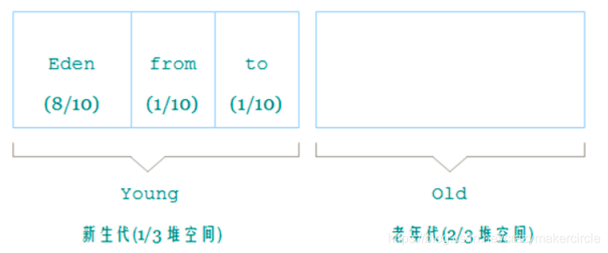

# 常见面试题
+ JVM的理解，Java8和之前的区别
+ OOM和StackOverFlowError，怎么分析？
+ Jvm的调优参数？
+ 内存快照如何抓取，如何分析Dump文件
+ JVM和类加载器

# 概念
+ JVM
+ 体系结构
+ 类加载器
+ 双亲委派机制
+ 沙箱安全机制
+ Native
+ PC寄存器
+ 方法区
+ 三种JVM
+ 堆
+ 老年区
+ 新生区
+ 堆内存调优
+ GC
+ JMM


# jvm包括哪些部分

JVM包含两个子系统和两个组件:

两个子系统为Class loader(类装载)、Execution engine(执行引擎)；

两个组件为Runtime data area(运行时数据区)、Native Interface(本地接口)。

# JVM内存模型




线程私有的:`虚拟机栈`、`本地方法栈`、`程序计数器`

线程共享的:`方法区`、`堆`


| 区域             | 共享 | 作用                                                         | 异常                                                         | 备注                                            |
| ---------------- | ---- | ------------------------------------------------------------ | ------------------------------------------------------------ | ----------------------------------------------- |
| **程序计数器**   | 私有 | 记录当前线程的执行字节码文件的行号信息                       | Java虚拟机规范中唯一一个没有规定OutOfMemoryError(内存不足错误)的区域。 | --                                              |
| **Java虚拟机栈** | 私有 | 存放基础数据类型,变量表、操作数据栈、方法出口                | 栈深大于允许的最大深度，抛出StackOverflowError(栈溢出错误)。<br/>内存不足时，抛出<br/>OutOfMemoryError(内存不足错误)。 |                                                 |
| **本地方法栈**   | 私有 | 和Java虚拟机栈类似，不过是为JVM用到的本地方法服务。          | 同上                                                         |                                                 |
| **堆**           | 共享 | 对象实例,数组等                                              | 内存不足时，抛出<br>OutOfMemoryError(内存不足错误)。         | 通过-Xmx和-Xms控制大小。<br/>GC的主要管理对象。 |
| **方法区**       | 共享 | 存放类信息（版本、字段、方法、接口等）、常量、静态变量、即时编译后的代码等数据。 | 内存不足时，抛出OutOfMemoryError(内存不足错误)。             |                                                 |

除了程序计数器之外,其他四部分都会内存溢出


## java堆和java的虚拟机栈的区别

+ 堆存放的是对象的实例和一些数组集合信息

  栈存放的是局部变量、返回结果等

+ 堆是线程共享的

  栈内存是线程私有的

+ 堆的物理地址分配是不连续的,在运行时创建,所以性能差一些

  栈是连续的先进后出原则,在编译的时候就确认内存的大小了,所以性能要强一些


## jvm如何判断对象是否已死

+ 引用计数法

  引用计数器判断该对象是否还有引用存在

+ 可达性分析法

  引用链上是否还有被引用

**四种引用**

+ 强引用：只要强引用还存在，那么垃圾回收器就永远不会回收掉这中引用对应的对象

+ 软引用：用来描述一些还有用，但并非必须的对象。这种对象会在内存溢出异常之前，也就是第二次回收的时候被回收掉。jdk1.2之后使用`SoftReference`类创建

+ 弱引用：描述非必须的对象，这种对象会直接被下一次的垃圾回收回收掉。也就是说无论内存是否足够都会被回收。jdk1.2之后使用`WeakReference`类创建

+ 虚引用：这是一种比较特殊的存在，他的目的是**能在这个对象被收集器回收的时候收到一个系统通知**。jdk1.2之后使用`PhantomReference`类创建

> 介绍一下强引用、软引用、弱引用、虚引用的区别？

> 思路： 先说一下四种引用的定义，可以结合代码讲一下，也可以扩展谈到ThreadLocalMap里弱引用用处。
>
> 参考答案：
>
> 1）强引用
>
> 我们平时new了一个对象就是强引用，例如 Object obj = new Object();即使在内存不足的情况下，JVM宁愿抛出OutOfMemory错误也不会回收这种对象。
>
> 2）软引用
>
> 如果一个对象只具有软引用，则内存空间足够，垃圾回收器就不会回收它；如果内存空间不足了，就会回收这些对象的内存。
>
> ```
> SoftReference<String> softRef=new SoftReference<String>(str);     // 软引用
> ```
>
> 用处： 软引用在实际中有重要的应用，例如浏览器的后退按钮。按后退时，这个后退时显示的网页内容是重新进行请求还是从缓存中取出呢？这就要看具体的实现策略了。
>
> （1）如果一个网页在浏览结束时就进行内容的回收，则按后退查看前面浏览过的页面时，需要重新构建
>
> （2）如果将浏览过的网页存储到内存中会造成内存的大量浪费，甚至会造成内存溢出
>
> 如下代码：
>
> ```
> Browser prev = new Browser();               // 获取页面进行浏览
> SoftReference sr = new SoftReference(prev); // 浏览完毕后置为软引用        
> if(sr.get()!=null){ 
>     rev = (Browser) sr.get();           // 还没有被回收器回收，直接获取
> }else{
>     prev = new Browser();               // 由于内存吃紧，所以对软引用的对象回收了
>     sr = new SoftReference(prev);       // 重新构建
> }
> ```
>
> 3）弱引用
>
> 具有弱引用的对象拥有更短暂的生命周期。在垃圾回收器线程扫描它所管辖的内存区域的过程中，一旦发现了只具有弱引用的对象，不管当前内存空间足够与否，都会回收它的内存。
>
> ```
> String str=new String("abc");    
> WeakReference<String> abcWeakRef = new WeakReference<String>(str);
> str=null;
> 等价于
> str = null;
> System.gc();
> ```
>
> 4）虚引用
>
> 如果一个对象仅持有虚引用，那么它就和没有任何引用一样，在任何时候都可能被垃圾回收器回收。虚引用主要用来跟踪对象被垃圾回收器回收的活动。

## 垃圾收集算法

+ 标记-清除法.会产生内存碎片
+ 复制算法.内存使用空间浪费内存变为原有的一半(需要两块内存空间进行非收集对象的复制操作)
+ 标记-整理清除法.
+ 分代收集算法
  + 年轻代-使用复制算法
  + 老年代使用标记整理算法

## 垃圾收集器

CMS:使用标记清除

G1:整体使用标记清除,局部使用复制

## 类加载机制和双亲委派


## 垃圾收集的堆内存分配(新生代、老年代)



新生代使用-Xms

老年代使用-Xmx

**新生代**

> 是用来存放新生的对象。一般占据堆的 1/3 空间。由于频繁创建对象，所以新生代会频繁触发MinorGC 进行垃圾回收。新生代又分为 Eden区、 ServivorFrom、 ServivorTo 三个区。
> Eden 区
> Java 新对象的出生地（如果新创建的对象占用内存很大，则直接分配到老年代）。当 Eden 区内存不够的时候就会触发 MinorGC，对新生代区进行一次垃圾回收。
> Servivor from 区
> 上一次 GC 的幸存者，作为这一次 GC 的被扫描者。
> Servivor to 区
> 保留了一次 MinorGC 过程中的幸存者。
> MinorGC 的过程（复制->清空->互换）
> MinorGC 采用复制算法。

**老年代**

> 主要存放应用程序中生命周期长的内存对象。
> 老年代的对象比较稳定，所以 MajorGC （常常称之为 FULL GC）不会频繁执行。在进行 FULL GC前一般都先进行了一次 MinorGC，使得有新生代的对象晋身入老年代，导致空间不够用时才触发。当无法找到足够大的连续空间分配给新创建的较大对象时也会提前触发一次 MajorGC 进行垃圾回收腾出空间。
> FULL GC 采用标记清除算法：首先扫描一次所有老年代，标记出存活的对象，然后回收没有标记的对象。 ajorGC 的耗时比较长，因为要扫描再回收。 FULL GC 会产生内存碎片，为了减少内存损耗，我们一般需要进行合并或者标记出来方便下次直接分配。当老年代也满了装不下的时候，就会抛出 OOM（Out of Memory）异常。

**永久代**

> 指内存的永久保存区域，主要存放 Class 和 Meta（元数据）的信息,Class 在被加载的时候被放入永久区域， 它和和存放实例的区域不同,GC 不会在主程序运行期对永久区域进行清理。所以这也导致了永久代的区域会随着加载的 Class 的增多而胀满，最终抛出 OOM 异常。

# 深拷贝和浅拷贝(深浅是针对是否新建一块区域来说的)

浅拷贝（shallowCopy）只是增加了一个指针指向已存在的内存地址，

深拷贝（deepCopy）是增加了一个指针并且申请了一个新的内存，使这个增加的指针指向这个新的内存，

使用深拷贝的情况下，释放内存的时候不会因为出现浅拷贝时释放同一个内存的错误。

浅复制：仅仅是指向被复制的内存地址，如果原地址发生改变，那么浅复制出来的对象也会相应的改变。

深复制：在计算机中开辟一块新的内存地址用于存放复制的对象。


# 附

JVM调优
说一下 JVM 调优的工具？
JDK 自带了很多监控工具，都位于 JDK 的 bin 目录下，其中最常用的是 jconsole 和 jvisualvm 这两款视图监控工具。

jconsole：用于对 JVM 中的内存、线程和类等进行监控；
jvisualvm：JDK 自带的全能分析工具，可以分析：内存快照、线程快照、程序死锁、监控内存的变化、gc 变化等。
常用的 JVM 调优的参数都有哪些？
-Xms2g：初始化推大小为 2g；
-Xmx2g：堆最大内存为 2g；
-XX:NewRatio=4：设置年轻的和老年代的内存比例为 1:4；
-XX:SurvivorRatio=8：设置新生代 Eden 和 Survivor 比例为 8:2；
–XX:+UseParNewGC：指定使用 ParNew + Serial Old 垃圾回收器组合；
-XX:+UseParallelOldGC：指定使用 ParNew + ParNew Old 垃圾回收器组合；
-XX:+UseConcMarkSweepGC：指定使用 CMS + Serial Old 垃圾回收器组合；
-XX:+PrintGC：开启打印 gc 信息；
-XX:+PrintGCDetails：打印 gc 详细信息。
调优命令有哪些？
Sun JDK监控和故障处理命令有jps jstat jmap jhat jstack jinfo

jps，JVM Process Status Tool,显示指定系统内所有的HotSpot虚拟机进程。
jstat，JVM statistics Monitoring是用于监视虚拟机运行时状态信息的命令，它可以显示出虚拟机进程中的类装载、内存、垃圾收集、JIT编译等运行数据。
jmap，JVM Memory Map命令用于生成heap dump文件
jhat，JVM Heap Analysis Tool命令是与jmap搭配使用，用来分析jmap生成的dump，jhat内置了一个微型的HTTP/HTML服务器，生成dump的分析结果后，可以在浏览器中查看
jstack，用于生成java虚拟机当前时刻的线程快照。
jinfo，JVM Configuration info 这个命令作用是实时查看和调整虚拟机运行参数
调优工具
常用调优工具分为两类,jdk自带监控工具：jconsole和jvisualvm，第三方有：MAT(Memory AnalyzerTool)、GChisto。

jconsole，Java Monitoring and Management Console是从java5开始，在JDK中自带的java监控和管理控制台，用于对JVM中内存， 线程和类等的监控
jvisualvm，jdk自带全能工具，可以分析内存快照、线程快照；监控内存变化、GC变化等。
MAT，Memory Analyzer Tool，一个基于Eclipse的内存分析工具，是一个快速、功能丰富的Javaheap分析工具，它可以帮助我们查找内存泄漏和减少内存消耗
GChisto，一款专业分析gc日志的工具
说说你知道的几种主要的JVM参数
思路： 可以说一下堆栈配置相关的，垃圾收集器相关的，还有一下辅助信息相关的。

参考答案：

1）堆栈配置相关

java -Xmx3550m -Xms3550m -Xmn2g -Xss128k -XX:MaxPermSize=16m -XX:NewRatio=4 -XX:SurvivorRatio=4 -XX:MaxTenuringThreshold=0
1
-Xmx3550m： 最大堆大小为3550m。

-Xms3550m： 设置初始堆大小为3550m。

-Xmn2g： 设置年轻代大小为2g。

-Xss128k： 每个线程的堆栈大小为128k。

-XX:MaxPermSize： 设置持久代大小为16m

-XX:NewRatio=4: 设置年轻代（包括Eden和两个Survivor区）与年老代的比值（除去持久代）。

-XX:SurvivorRatio=4： 设置年轻代中Eden区与Survivor区的大小比值。设置为4，则两个Survivor区与一个Eden区的比值为2:4，一个Survivor区占整个年轻代的1/6

-XX:MaxTenuringThreshold=0： 设置垃圾最大年龄。如果设置为0的话，则年轻代对象不经过Survivor区，直接进入年老代。

2）垃圾收集器相关

-XX:+UseParallelGC-XX:ParallelGCThreads=20-XX:+UseConcMarkSweepGC -XX:CMSFullGCsBeforeCompaction=5-XX:+UseCMSCompactAtFullCollection：
1
-XX:+UseParallelGC： 选择垃圾收集器为并行收集器。

-XX:ParallelGCThreads=20： 配置并行收集器的线程数

-XX:+UseConcMarkSweepGC： 设置年老代为并发收集。

-XX:CMSFullGCsBeforeCompaction：由于并发收集器不对内存空间进行压缩、整理，所以运行一段时间以后会产生“碎片”，使得运行效率降低。此值设置运行多少次GC以后对内存空间进行压缩、整理。

-XX:+UseCMSCompactAtFullCollection： 打开对年老代的压缩。可能会影响性能，但是可以消除碎片

3）辅助信息相关

-XX:+PrintGC-XX:+PrintGCDetails
1
-XX:+PrintGC 输出形式:

[GC 118250K->113543K(130112K), 0.0094143 secs] [Full GC 121376K->10414K(130112K), 0.0650971 secs]

-XX:+PrintGCDetails 输出形式:

[GC [DefNew: 8614K->781K(9088K), 0.0123035 secs] 118250K->113543K(130112K), 0.0124633 secs] [GC [DefNew: 8614K->8614K(9088K), 0.0000665 secs][Tenured: 112761K->10414K(121024K), 0.0433488 secs] 121376K->10414K(130112K), 0.0436268 secs

怎么打出线程栈信息。
思路： 可以说一下jps，top ，jstack这几个命令，再配合一次排查线上问题进行解答。

参考答案：

输入jps，获得进程号。
top -Hp pid 获取本进程中所有线程的CPU耗时性能
jstack pid命令查看当前java进程的堆栈状态
或者 jstack -l > /tmp/output.txt 把堆栈信息打到一个txt文件。
可以使用fastthread 堆栈定位，fastthread.io/	


---

博主:https://blog.csdn.net/crazymakercircle/article/details/113587338