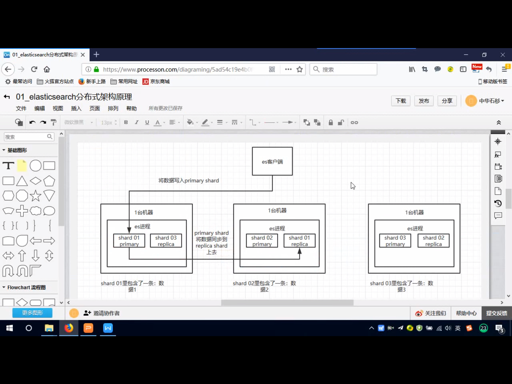

# lucene是什么

一个全文检索的包

# 倒排索引


# 全文检索


# elasticsearch是什么,对比solr

es的基本单位就是索引.相当于mysql的一张表

index->type->mapping->document-filed

类似mysql的`表->表中一类数据(不一定有)->类似结构定义->一条数据->一个字段 `

# 分布式搜索引擎


# es的分布式架构原理

es底层依赖于lucene进行开发的,

分布式:

es在多台机器上会有多个节点,会选举一个节点作为master节点(维护索引的元数据等,宕机了会在剩下的节点中再重新选举一个节点),每个节点的索引中都会同时有其他节点的同步shard进行数据同步

写入可以只会写入primary中.读可以再primary/replica中读



# es的写入数据的工作原理,es查询数据的工作原理

> 写操作

客户端执行写操作

将写入的数据进行hash算法计算写入哪个节点

写入之后,通过replica同步到其他的节点上

同步完成之后协调节点会回馈响应给客户端


> 

# es如何提供查询性能


# es的部署架构是什么,每个索引的数据量多少,诶个索引大概多少分片


# 0. 理解es核心
## 1. 什么是倒排索引
通俗的说，正向索引是按照key来找value。
【倒排索引】是按照value来找key。<br>
也就是获取文本内容，使用文本内容分词器。将对应的词分出来，按照词分类。在搜索的时候直接使用词就可以了
## 2. 什么是分词
## 3. 什么是es插件
1. 首先是一个java写的基于lucene的搜索引擎
2. 使用倒排索引来进行搜索


# 1. 为什么使用es
1. 使用模糊查询like，不能使用索引
2. 数据量很多的时候，要求查询速度要快
3. 这样就只能使用es来帮助

# 2. es集群

首先，es天生就是支持分布式部署的。

节点分类：
1. 候选主节点（master node），<font color="yellow">集群会从候选主节点中选出一个主节点</font>。主要功能是：
   1. 创建索引
   2. 删除索引
   3. 分配分片
   4. 追踪集群的几点状态

并没有分发请求的功能
2. 数据节点
3. 客户端节点
4. 协调节点
## 2.1 候选主节点
<font color="re">脑裂：</font> 就是当网络或者负载等原因导致主节点停止响应。导致重新选择主节点，可能会出现多个主节点的情况，这种情况就叫做脑裂

解决方案：设置`discovery.zen.minimum_master_nodes`，建议设置成**(有资格成为master的数量/2)+1**，也就是保证候选主节点数在一般以上

一般对于候选主节点建议如下设置
```
node.master = true
node.data = false
```

## 2.2 数据节点
```
node.master = false
node.data = true
默认情况下，节点既可以是数据节点，又可以是候选主节点。为了防止出现脑裂现象，所以一般将两者分开
```
功能：CURD，搜索，聚合。

特点：负载比较大，所以对硬件要求较高

## 2.3 客户端节点

负责服务的转发，汇总等。既不做候选主节点，也不做数据节点


# 2. 分片

概念：分片是es中最小存储单元，是所有数据的文件块。所有数据均衡的存储在集群中各个节点的分片中


