# 二叉树的前中后序遍历

+ 前序遍历:根左右
+ 中序遍历:左根右
+ 后序遍历:左右根

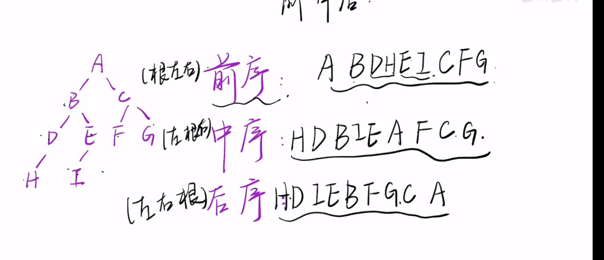


# 二叉树、平衡二叉树、红黑树、B-树、B+树

## 二叉树

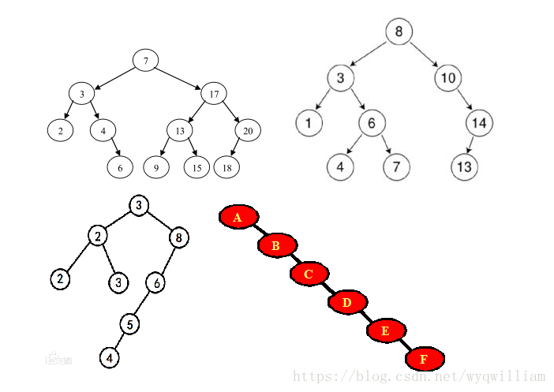


特性:

1. 左节点一定小于根节点
2. 右节点一定大于根节点
3. 对二叉树中序遍历就是一个有序集合

查询时间复杂度是O(logn)

## 平衡二叉树

特性:

1. 左右子树的高度差不能超过1

目的:

1. 减少二叉查找的层次,提高查询速度


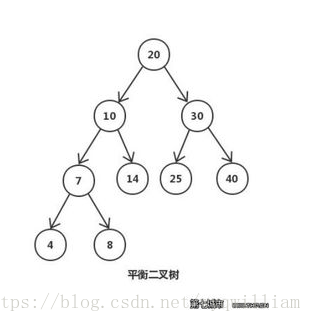


## 红黑树

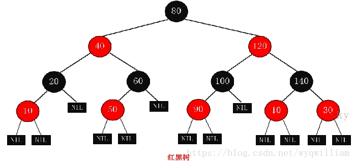

特性:

1. 根节点是黑色的,每个叶节点都是不存储数据的黑色的节点
2. 任何相邻的两个节点不能都是红色
3. 从一个节点到该节点的子孙节点的所有路径包含相同数目的黑节点

功能:

1. 接近平衡的二叉树
2. 存储有序集合,时间复杂度是O(logN),效率较高.查询最多是2(log(n+1))
3. 虽然复杂,但是最坏查询情况的运行时间也是良好的
4. 插入和删除操作相对于二叉树要好的多

使用:

1. Java中的Tree(HashMap、TreeMap、TreeSet)就是红黑树实现的

普通二叉树的插入和删除操作会涉及到更多的树结构的变更.所以会相对复杂

红黑树的插入和删除只需要直接增加就好了


**为什么会产生红黑树的数据结构?**

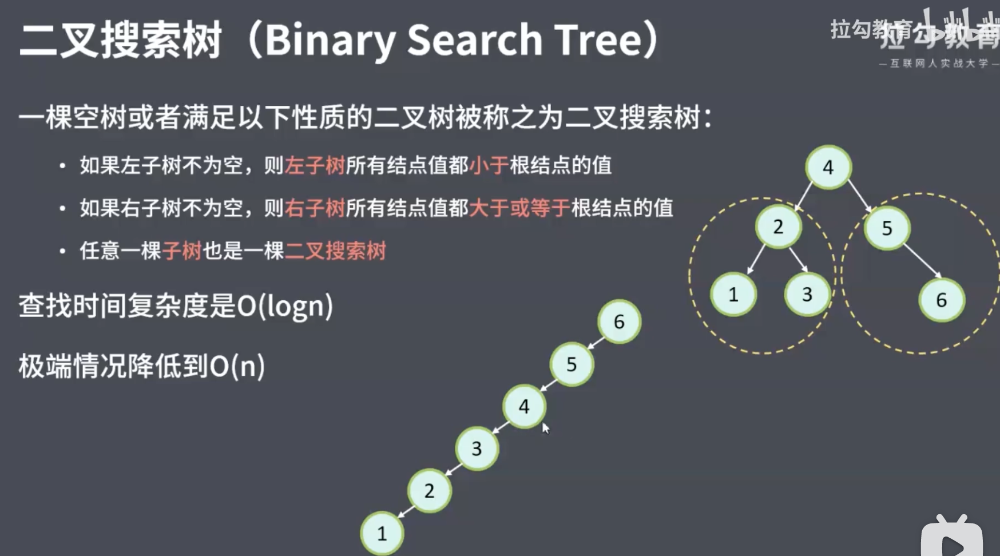

在使用二叉搜索树进行查找的时候,极端情况会出现上述的情况.时间复杂度就会降到O(N)

优化二叉搜索树就形成了一种**平衡二叉搜索树(AVL树)**

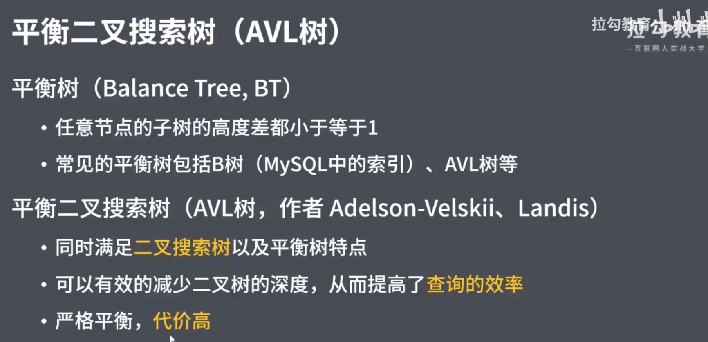

但是平衡二叉搜索树的维持会很消耗插入和删除节点的操作.也就是插入和删除节点的时候会很麻烦去维护这个平衡树

总结

1. 为了解决二叉树可能出现极端情况导致时间复杂度变成O(N)所以形成了`平衡二叉树`
2. 但是平衡二叉树又会导致插入和删除节点的时候维护整个树的平衡会很麻烦.所以提出了`红黑树`.在插入和删除的时候通过一些特殊的操作,来保证相对平衡

**Java实现一个红黑树**

```java
class RBTreeNode{
  public int value;
  public boolean isRed;
  public RBTreeNode left;
  public RBTreeNode right;
  public RBTreeNode parent;
}
```

**红黑树的生成**

[blog红黑树创建过程](https://blog.csdn.net/Procedure_monkey/article/details/86481685)

**红黑树的时间复杂度**

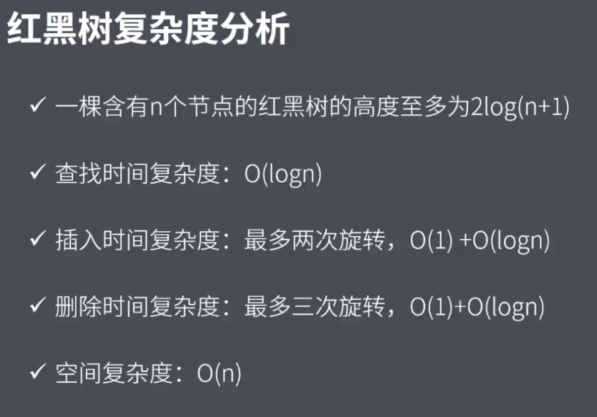

**平衡二叉树与红黑树**

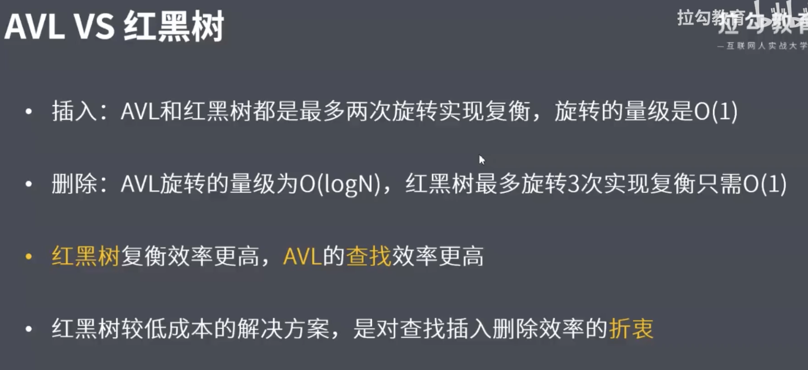


### 红黑树的面试问题

1. hashMap使用红黑树解决hash冲突
2. 红黑树的数据结构如何定义
3. 红黑树的各种操作的时间复杂度
4. 红黑树的优点

## B-树(B树)

特点:

1. 一个节点可能有多个元素,同时其中元素也是顺序排序的

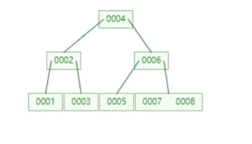

## B+树

特点:

1. 基于B树
2. 叶子节点之间使用指针相互连接
3. 叶子节点存储插入的所有数据


B树和B+树的数据结构的不同点.为什么mysql使用B+树


## Mysql使用的B+树

1. 传统的B树
2. 叶子结点有双向指针

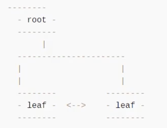

### 页

操作系统从磁盘取数据,一次最少取**一页数据**(1页=4KB)

针对mysql的InnoDB中的一页==16KB.也就是说每次进行磁盘的IO操作,都会从磁盘中获取到16KB的数据

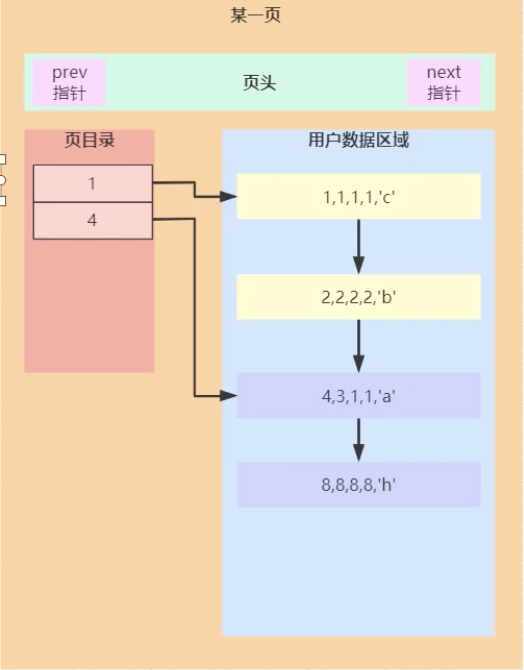

+ 使用页目录进行辅助查找.而且页目录使用的是二分查找法

+ 多张页的查找也是顺序的查找,而且也有一个针对页级的一个目录维护

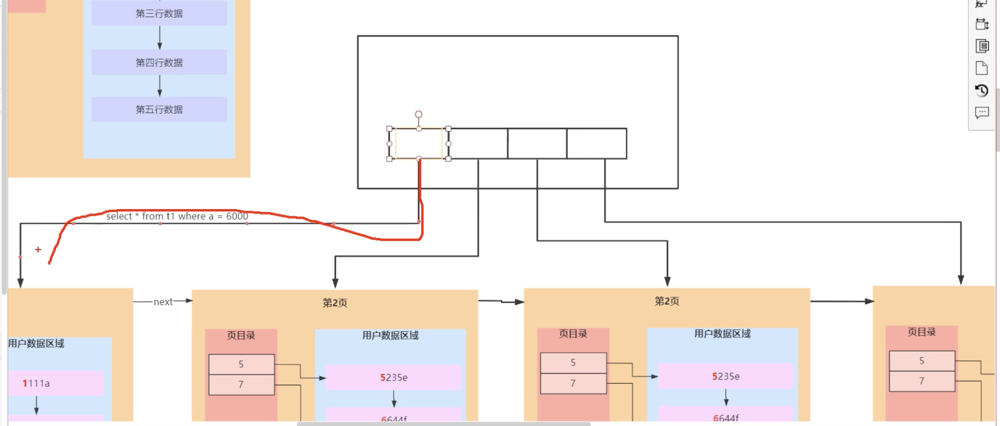


**所以这个地方就和B+树很像**

以空间换时间,除了叶子节点其他的节点就像是目录一样

叶子结点存放的才是数据.其他的节点是为了能更快的查找到对应的数据页
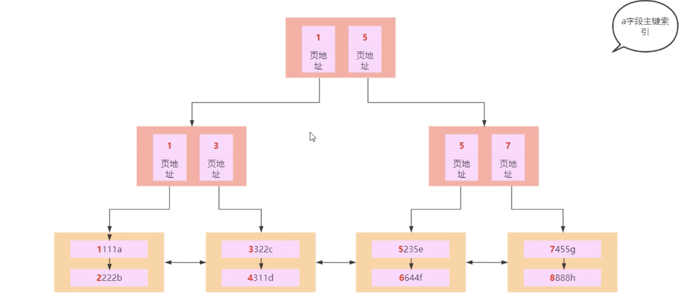

# 什么是哈夫曼树

1. 两个孩子节点的和是根节点的值

**构造哈夫曼树**
第一步、将数字排序
第二步、找到最小的两个数字构造树并将和放入数字队列中
第三步、重复上述两个步骤

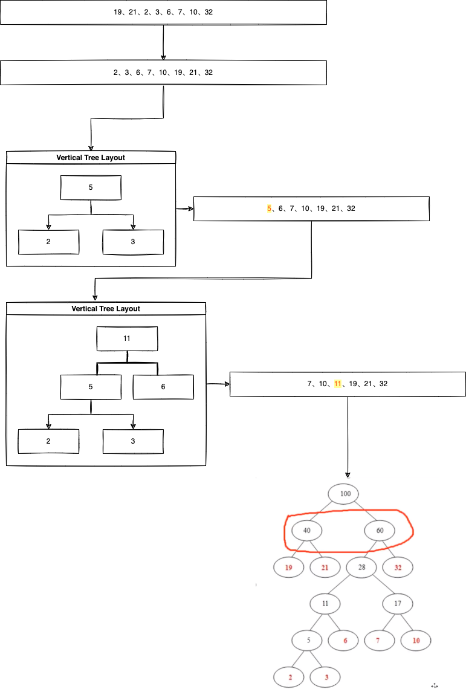


# 面试题

1. 为什么推荐使用id自增作为主键

   自增作为主键可以更快的进行插入,因为是直接在队尾进行插入的

2. 为什么mysql的B+树是一种双向指针

   为了兼顾范围查询中的<

3. 联合索引

   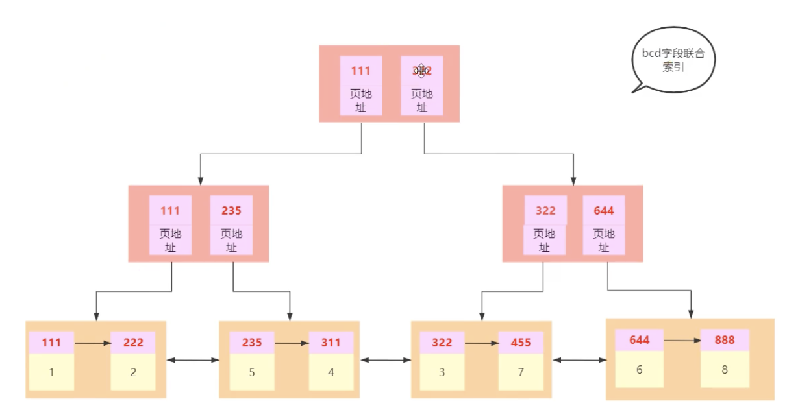

注意,联合索引是一种非聚集索引.非聚集索引查到的结果是一个字段,这个字段会是一种聚集索引的行为,再使用这个字段获取整行数据

4. (最左前缀原则)联合索引字段,如果查询语句中缺失联合索引的最左索引字段,就不能走索引

   如index(a,b,c)索引

   如果查询语句是`where a=1,b=2`;则可以......索引底层比较使用的类似为**120**

   如果查询语句是`where b=1,c=1`;则不可以......索引底层使用的类似为**011**.所有数据都比这个大,所以没办法走索引

5. 如果有联合索引,进行某个字段的>操作

   这个时候不一定走索引,mysql会计算索引的操作的消耗和全表扫描的消耗.

   索引:使用联合索引找到对饮的主键字段,发现有多个主键字段.就需要进行多次回表操作获取到多条数据.这个时候就需要消耗(一次索引,多次回表).相对于全表扫描性能还要差些了

   比如八条数据,如果是a>1会需要进行7次回表.如果是a>6只进行2次回表,这个时候就会走索引

   如果说不查找所有数据,只获取索引列的数据,就不需要回表操作.这个时候就会走索引


# 为什么会有聚集索引和非聚集索引

1. 主键索引会维护一套B+树的表,叶子结点就是整行数据
2. 如果再创建索引,如果再维护一套表数据,就会出现数据冗余与后续做update等操作的复杂度
3. 所以再创建复合索引等就是使用的一种非聚集索引来创建的.
4. 非聚集索引的值指向聚集索引的字段信息.再通过这个字段信息查找到整行数据(**回表**)


# 如果一个innorDB没有设置主键索引

1. mysql会检查有没有唯一索引,如果有的话就默认定义为主键索引
2. 如果没有唯一索引,就会创建一个隐藏的主键索引(rowId)

# 构造平衡二叉树

1. 新增一个元素
2. 标出BF（最深左子树-最深右子树的绝对值）
3. 找到最下面的那个BF=2或BF=-2的节点，定义为a
4. 从a往下找导致不平衡的两个节点。加上a一共三个节点
5. 取这三个节点中间的那个值作为根节点，小于的放左边，大于的放右边

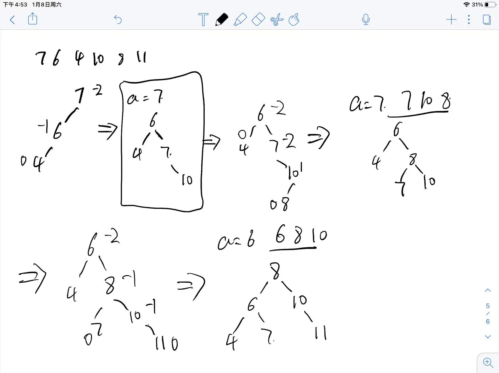
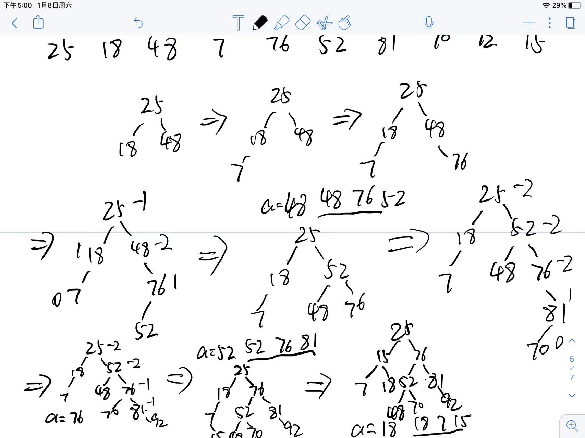
