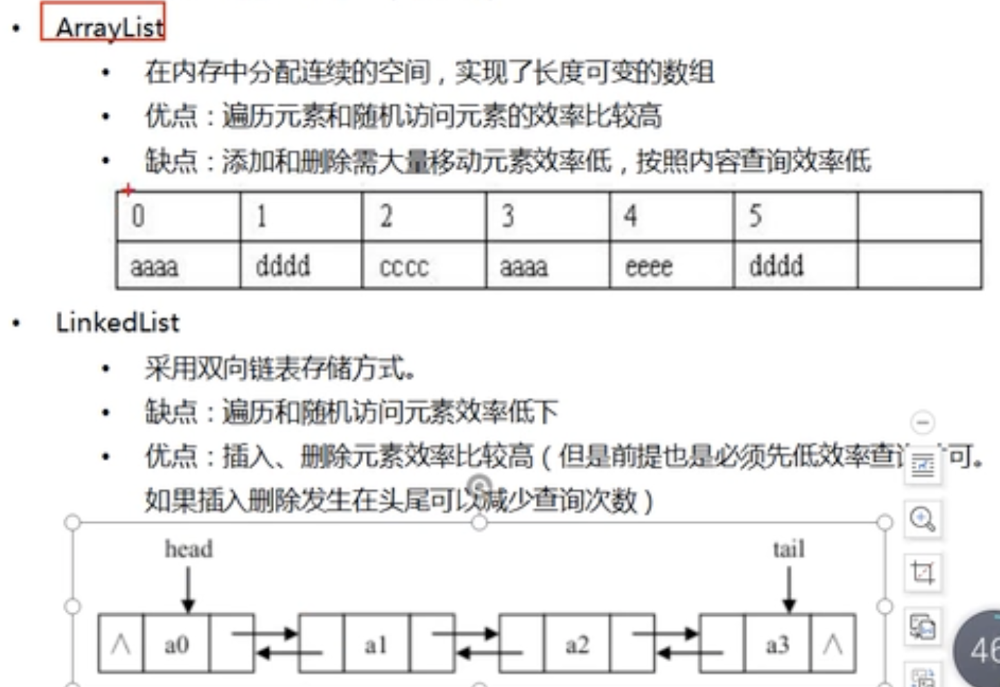

# 问题

1、Vector和ArrayList

> Vector是长度可变的数组，是线程安全的。每个方法都加了**synchronized**关键字。其他的和ArrayList一样

2、ConcurrentHashMap、hashTable、HashMap

> 线程安全：前两个是线程安全的，hashMap线程不安全
>
> 锁的实现：前两个线程安全的实现不一样。concurrenthashMap锁的粒度更小（1.8之前分段锁，之后是Node节点）。hashTable是`synchronized`加在方法上，相当于对象级的锁。
>
> 红黑树优化：concurrentHashMap和HashMap都有红黑树的优化。HashTable没有


# 集合

## List、Set和Map的理解

1. linked代表链表
2. hash代表hashTable,无序,速度快

速度

链表<二叉树<哈希表

+ List---有序,可重复

  + ArrayList

    数组的顺序表,连续的空间,长度可变的数组

    查快,增删改慢

  + LinkedList

    双向链表的实现,不连续的空间,每个元素指向上一个和下一个元素

    增删改快,查慢

  + Vector

    与ArrayList一致,只是这个是线程安全的(有锁,故效率要低)

+ Set---无序,不可重复

  + HashSet

    底层结构是哈希表

    hashTable(所以无序,不可重复)

    hashTable增删改查都快

  + LinkedHashSet

    使用hash表存储,同时又在hash表上有链表来维护顺序

    所以是有序的

  + TreeSet

    二叉树的红黑树

    有序,查询速度比list快

    但是没有hash表快

+ Map

  + `HashMap`：线程不同步。根据`key`的`hashcode`进行存储，内部使用静态内部类`Node`的数组进行存储，默认初始大小为16，每次扩大一倍。当发生Hash冲突时，采用拉链法（链表）。**可以接受为null的键值\(key\)和值\(value\)**。JDK 1.8中：当单个桶中元素个数大于等于8时，链表实现改为红黑树实现；当元素个数小于6时，变回链表实现。由此来防止hashCode攻击。

+ `LinkedHashMap`：**保存了记录的插入顺序**，在用Iterator遍历LinkedHashMap时，先得到的记录肯定是先插入的. 也可以在构造时用带参数，按照应用次数排序。在遍历的时候会比HashMap慢，不过有种情况例外，当HashMap容量很大，实际数据较少时，遍历起来可能会比LinkedHashMap慢，因为LinkedHashMap的遍历速度只和实际数据有关，和容量无关，而HashMap的遍历速度和他的容量有关。

  + `TreeMap`：线程不同步，基于 **红黑树*- （Red-Black tree）的NavigableMap 实现，**能够把它保存的记录根据键排序,默认是按键值的升序排序，也可以指定排序的比较器，当用Iterator 遍历TreeMap时，得到的记录是排过序的。**

+ `HashTable`：线程安全，HashMap的迭代器\(Iterator\)是`fail-fast`迭代器。**HashTable不能存储NULL的key和value。**

  + `ConcurrentHashmap`：支持并发操作的 Hash 表，`ConcurrentHashmap` 具有和 `HashTable` 同样的功能，并且具有相应的方法。即使所有操作都是线程安全的，但是并不需要进行加锁。


## 集合和数组

数组相对于集合的缺点

+ 数组必须在初始化时定义大小
+ 数组是连续的,插入、更新、删除都需要进行数组的重排
+ 数组的操作缺乏封装


## list、set与map

list是可重复,有序

set是不可重复,无序

map的key不可重复,value可重复


## arrayList和LinkedList

arrayList,是顺序表

linkedList,是双向链表

+ List

  有序,可重复

+ ArrayList

  +  顺序表的实现,连续的空间,长度可变的数组
  +  优点:遍历元素和随机访问元素销量高
  +  添加和删除元素效率低,按照内容查询销量慢

+ LinkedList

  + 双向链表的实现,不连续,上一个指向下一个
  + 遍历和随机访问速度慢
  + 插入、删除元素销量高



## Vector

vector和ArrayList一样,都是基于数组的可变长结构,唯一区别在于其方法加了Synchronized,是线程安全的

# String相关

## 1.1 特性

+ <font color="red">**不可变字符序列**</font>：不可变性，就是不会修改原本字符串的地址信息，重新赋值之后是重新创建了一个字符串

  + String a="abc"; String b="abc" a==b;   b="def";    a!=b（地址相同，修改成不一样的，就需要重新创建一个）

  + String a="abc"; String b=a+"def"    a!=b（在原有基础上修改了，就需要重新造一个）

    ```java
        String str = "abcd";
        char[] c = {'a', 'b', 'c', 'd'};
        
        public void change(String str, char[] c) {
            str = "efgh";
            c[0] = '0';
        }
        public static void main(String[] args) {
            HeapTest t=new HeapTest();
            t.change(t.str,t.c);
            System.out.println(t.str); //abcd
            System.out.println(t.c);  //0bcd
        }
    ```

+ 字符串常量池中不会存储相同的内容的字符串

  String 

+ 引用数据类型

+ 不可被继承：`public final class String`

+ 序列化：`implements Serializable`，自动实现了序列化，所以可以直接跨进程进行传输（类似Json）

+ 底层存储的结构：**JDK1.9之前使用的是`char[] value` **,**JDK1.9及其之后使用的是`byte[] value`**

  JDK1.9之前是char数组结构，之后是byte数组结构+编码标记

  修改原因：一个char=2个byte。一般一个英文字符，一个byte就能存储下。所以修改成byte[]。同时补充一个字符集约束，只针对类似英文字符/拉丁文字等。其他还是存储两个byte


## 1.2 底层结构

String 的String Pool是一个固定大小的HashTable，默认大小是1009（jdk6 默认1009 jdk7及之后默认 60013。jdk8要求最小值是1009）。相同hash的字符串是存储在同一个hash值的外接链表中的。


如果hash冲突过多导致链表长度过长，就会影响效率


## 1.3 String内存分配（在内存中放在哪）

JDK1.6 永久代中（永久代较小，垃圾回收频率较低）

JDK1.7之后放入堆中，统一管理实例对象内存。


## 1.4 字符串拼接

1. **常量和常量结果在常量池中**     在编译器进行拼接获取结果
2. **有一个变量   结果就存放在堆**中
3. 如果拼接结果调用了.intern()方法。就会将其放入常量池中（常量池中有就不放，没有就放）

```java
//带有变量的拼接方式：StringBuilder来进行拼接
String a = "a";   //"a"是常量，a是变量。此时放入了常量池中
String b = "b";   //"b"是常量，b是变量。此时放在常量池中
String ab = "ab";

String result = a + b;//此时相当于是new String("") 创建的一个result对象，计算结果在堆中
/*
底层实现步骤：
	1. StringBuilder stringBuilder=new StringBuilder;
	2. stringBuilder.append(a);
	3. stringBuilder.append(b);
	4. stringBuilder.toString();     相当于String result = new String(stringBuilder);
*/
System.out.println(ab==result);//false
//说明ab和result的地址不相同
```


```java
//不带变量的拼接方式  使用编译期优化
final String a="a";
final String b="b";
String ab="ab";
String result=a+b;

Sysrem.out.println(ab==result);//true
```

`final`修饰类、方法、基本数据类型、引用数据类型的时候，有些时候可以进行编译期优化


## 1.5 intern()

一个native的方法

**作用**：声明一个String对象，去常量池中查询是否该对象，如果不存在就将这个字符串放入常量池中（一判断二存入）

(在JDK7及其之后，同时会检查堆中是否有这个对象，如果有就直接在字符串常量池中保存堆中那个对象的地址)

`String s="蛋炒饭"`和`String s=new String("蛋炒饭").intern()`都会将“蛋炒饭”放入常量池中。（ps：String s=new String("蛋炒饭")会在堆中生成一个对象、在常量池中生成一个对象；并返回堆中生成对象的地址）


## 1.6 为什么要使用intern()，节省空间，垃圾回收

`arr[i]=new String(String.valueof(data[i].intern()))`

调用intern()的时候，会返回对应的字符串常量池中的地址信息。则数组中存储的就是字符串常量池中的地址信息。然后创建在堆中的字符串对象因为没有引用会被垃圾回收给回收掉。

1. 赋值的时候使用的是字符串常量的地址信息
2. 原本创建的堆中对象因为没有使用会被回收

总结：大量使用字符串的时候，推荐增加使用intern()来大大节省内存空间。


# 其他

## JIT的产生

我们需要格外注意的是 `.class->机器码` 这一步。在这一步 JVM 类加载器首先加载字节码文件，然后通过解释器逐行解释执行，这种方式的执行速度会相对比较慢。而且，有些方法和代码块是经常需要被调用的(也就是所谓的热点代码)，所以后面引进了 JIT（just-in-time compilation） 编译器，而 JIT 属于运行时编译。当 JIT 编译器完成第一次编译后，其会将字节码对应的机器码保存下来，下次可以直接使用。而我们知道，机器码的运行效率肯定是高于 Java 解释器的。这也解释了我们为什么经常会说 **Java 是编译与解释共存的语言** 。


## 包装类常量池

Byte、Short、Integer、Long这四种类型会创建(-128~127)的缓存数据。也就是在这个区间内的数据不需要重新申请内存空间。直接从缓存中获取即可

ps：所以进行==判断的时候，会发现这些包装类的对象（创建的多个同数值的对象）其实指向的内存地址是同一个（使用缓存仅限于使用Integer i=10这种语句，如果使用了`new`关键字还是会创建新的对象）

`Integer i1=40` 这一行代码会发生装箱，也就是说这行代码等价于 `Integer i1=Integer.valueOf(40)` 。因此，`i1` 直接使用的是常量池中的对象。而`Integer i2 = new Integer(40)` 会直接创建新的对象。

### 自动装箱与拆箱了解吗？原理是什么？

**什么是自动拆装箱？**

- **装箱**：将基本类型用它们对应的引用类型包装起来；
- **拆箱**：将包装类型转换为基本数据类型；

举例：

```java
Integer i = 10;  //装箱
int n = i;   //拆箱
```

上面这两行代码对应的字节码为：

```java
   L1

    LINENUMBER 8 L1

    ALOAD 0

    BIPUSH 10

    INVOKESTATIC java/lang/Integer.valueOf (I)Ljava/lang/Integer;

    PUTFIELD AutoBoxTest.i : Ljava/lang/Integer;

   L2

    LINENUMBER 9 L2

    ALOAD 0

    ALOAD 0

    GETFIELD AutoBoxTest.i : Ljava/lang/Integer;

    INVOKEVIRTUAL java/lang/Integer.intValue ()I

    PUTFIELD AutoBoxTest.n : I

    RETURN
```

从字节码中，我们发现装箱其实就是调用了 包装类的`valueOf()`方法，拆箱其实就是调用了 `xxxValue()`方法。

因此，

- `Integer i = 10` 等价于 `Integer i = Integer.valueOf(10)`
- `int n = i` 等价于 `int n = i.intValue()`;

注意：**如果频繁拆装箱的话，也会严重影响系统的性能。我们应该尽量避免不必要的拆装箱操作。**

```java
private static long sum() {
    // 应该使用 long 而不是 Long
    Long sum = 0L;
    for (long i = 0; i <= Integer.MAX_VALUE; i++)
        sum += i;
    return sum;
}
```

## 深拷贝和浅拷贝以及引用拷贝？

关于深拷贝和浅拷贝区别，我这里先给结论：

- **浅拷贝**：**不同的对象，但是内部成员对象是同一个**。浅拷贝会在堆上创建一个新的对象（区别于引用拷贝的一点），不过，如果原对象内部的属性是引用类型的话，浅拷贝会直接复制内部对象的引用地址，也就是说拷贝对象和原对象共用同一个内部对象。
- **深拷贝** ：**深拷贝会完全复制整个对象，包括这个对象所包含的内部对象。**

上面的结论没有完全理解的话也没关系，我们来看一个具体的案例！

**浅拷贝**

浅拷贝的示例代码如下，我们这里实现了 `Cloneable` 接口，并重写了 `clone()` 方法。

`clone()` 方法的实现很简单，直接调用的是父类 `Object` 的 `clone()` 方法。

```java
public class Address implements Cloneable{
    private String name;
    // 省略构造函数、Getter&Setter方法
    @Override
    public Address clone() {
        try {
            return (Address) super.clone();
        } catch (CloneNotSupportedException e) {
            throw new AssertionError();
        }
    }
}

public class Person implements Cloneable {
    private Address address;
    // 省略构造函数、Getter&Setter方法
    @Override
    public Person clone() {
        try {
            Person person = (Person) super.clone();
            return person;
        } catch (CloneNotSupportedException e) {
            throw new AssertionError();
        }
    }
}
```

测试 ：

```java
Person person1 = new Person(new Address("武汉"));
Person person1Copy = person1.clone();
// true
System.out.println(person1.getAddress() == person1Copy.getAddress());
```

从输出结构就可以看出， `person1` 的克隆对象和 `person1` 使用的仍然是同一个 `Address` 对象。

**深拷贝**

这里我们简单对 `Person` 类的 `clone()` 方法进行修改，连带着要把 `Person` 对象内部的 `Address` 对象一起复制。

```java
@Override
public Person clone() {
    try {
        Person person = (Person) super.clone();
        person.setAddress(person.getAddress().clone());
        return person;
    } catch (CloneNotSupportedException e) {
        throw new AssertionError();
    }
}
```

测试 ：

```java
Person person1 = new Person(new Address("武汉"));
Person person1Copy = person1.clone();
// false
System.out.println(person1.getAddress() == person1Copy.getAddress());
```

从输出结构就可以看出，虽然 `person1` 的克隆对象和 `person1` 包含的 `Address` 对象已经是不同的了。

**那什么是引用拷贝呢？** 简单来说，引用拷贝就是两个不同的引用指向同一个对象。


## 泛型

### Java 泛型了解么？什么是类型擦除？介绍一下常用的通配符？

**Java 泛型（generics）** 是 JDK 5 中引入的一个新特性, 泛型提供了编译时**类型安全检测机制**，该机制允许程序员在编译时检测到非法的类型。泛型的本质是参数化类型，也就是说所操作的数据类型被指定为一个参数。

Java 的泛型是伪泛型，这是因为 Java 在运行期间，所有的泛型信息都会被擦掉，这也就是通常所说类型擦除 。


```java
List<Integer> list = new ArrayList<>();

list.add(12);
//这里直接添加会报错
list.add("a");
Class<? extends List> clazz = list.getClass();
Method add = clazz.getDeclaredMethod("add", Object.class);
//但是通过反射添加是可以的
//这就说明在运行期间所有的泛型信息都会被擦掉
add.invoke(list, "kl");
System.out.println(list);
```

泛型一般有三种使用方式: 泛型类、泛型接口、泛型方法。

**1.泛型类**：

```java
//此处T可以随便写为任意标识，常见的如T、E、K、V等形式的参数常用于表示泛型
//在实例化泛型类时，必须指定T的具体类型
public class Generic<T> {
    private T key;
    public Generic(T key) {
        this.key = key;
    }
    public T getKey() {
        return key;
    }
}
```

如何实例化泛型类：

```java
Generic<Integer> genericInteger = new Generic<Integer>(123456);
```

**2.泛型接口** ：

```java
public interface Generator<T> {
    public T method();
}
```

实现泛型接口，不指定类型：

```java
class GeneratorImpl<T> implements Generator<T>{
    @Override
    public T method() {
        return null;
    }
}
```

实现泛型接口，指定类型：

```java
class GeneratorImpl implements Generator<String>{
    @Override
    public String method() {
        return "hello";
    }
}
```

**3.泛型方法** ：

```java
public static <E> void printArray(E[] inputArray) {
    for (E element : inputArray) {
        System.out.printf("%s ", element);
    }
    System.out.println();
}
```

使用：

```java
// 创建不同类型数组： Integer, Double 和 Character
Integer[] intArray = { 1, 2, 3 };
String[] stringArray = { "Hello", "World" };
printArray(intArray);
printArray(stringArray);
```

### 常用的通配符有哪些？

**常用的通配符为： T，E，K，V，？**

- ？ 表示不确定的 Java 类型
- T (type) 表示具体的一个 Java 类型
- K V (key value) 分别代表 Java 键值中的 Key Value
- E (element) 代表 Element

### 你的项目中哪里用到了泛型？

- 可用于定义通用返回结果 `CommonResult<T>` 通过参数 `T` 可根据具体的返回类型动态指定结果的数据类型
- 定义 `Excel` 处理类 `ExcelUtil<T>` 用于动态指定 `Excel` 导出的数据类型
- 用于构建集合工具类。参考 `Collections` 中的 `sort`, `binarySearch` 方法
- ......

## 反射

### 何为反射？

如果说大家研究过框架的底层原理或者咱们自己写过框架的话，一定对反射这个概念不陌生。

反射之所以被称为框架的灵魂，主要是因为它赋予了我们在运行时分析类以及执行类中方法的能力。

通过反射你可以获取任意一个类的所有属性和方法，你还可以调用这些方法和属性。

### 反射机制优缺点

- **优点** ： 可以让咱们的代码更加灵活、为各种框架提供开箱即用的功能提供了便利
- **缺点** ：让我们在运行时有了分析操作类的能力，这同样也增加了安全问题。比如可以无视泛型参数的安全检查（泛型参数的安全检查发生在编译时）。另外，反射的性能也要稍差点，不过，对于框架来说实际是影响不大的。[Java Reflection: Why is it so slow?  (opens new window)](https://stackoverflow.com/questions/1392351/java-reflection-why-is-it-so-slow)

### 反射的应用场景

像咱们平时大部分时候都是在写业务代码，很少会接触到直接使用反射机制的场景。

但是，这并不代表反射没有用。相反，正是因为反射，你才能这么轻松地使用各种框架。像 Spring/Spring Boot、MyBatis 等等框架中都大量使用了反射机制。

**这些框架中也大量使用了动态代理，而动态代理的实现也依赖反射。**

比如下面是通过 JDK 实现动态代理的示例代码，其中就使用了反射类 `Method` 来调用指定的方法。

```java
public class DebugInvocationHandler implements InvocationHandler {
    /**
     * 代理类中的真实对象
     */
    private final Object target;

    public DebugInvocationHandler(Object target) {
        this.target = target;
    }


    public Object invoke(Object proxy, Method method, Object[] args) throws InvocationTargetException, IllegalAccessException {
        System.out.println("before method " + method.getName());
        Object result = method.invoke(target, args);
        System.out.println("after method " + method.getName());
        return result;
    }
}
```

另外，像 Java 中的一大利器 **注解** 的实现也用到了反射。

为什么你使用 Spring 的时候 ，一个`@Component`注解就声明了一个类为 Spring Bean 呢？为什么你通过一个 `@Value`注解就读取到配置文件中的值呢？究竟是怎么起作用的呢？

这些都是因为你可以基于反射分析类，然后获取到类/属性/方法/方法的参数上的注解。你获取到注解之后，就可以做进一步的处理。

# 问题

## String_`new String("ab")`会创建几个对象

两个对象，可以通过字节码指令看出来

+ `new`的一个字符串对象，存放在堆空间中
+ 还有一个"ab"在常量池中的对象。


> new String("a")+new String("b")？
>
> 
>
> 1. StringBuilder 涉及拼接，就需要StringBuilder
> 2. new String("a")
> 3. ldc将"a"放入常量池中
> 4. new String("b")
> 5. ldc将"b"放入常量池中
> 6. 结果调用toString()方法：new String()。这里的toString()方法的调用，在字符串常量池中不会生成result
>
> **所以最终创建了六个对象。且不会在常量池中生成"ab"字符串对象**


## String_intern()方法的使用

```java
public class StringInternTest{
  	public static void main(String[] args){
      	String s=new String("1");//创建了对象，s中保存的是对象在堆中的地址信息
      	s.intern();//此时是将"1"放入字符串常量池中。但是已经有了，所以该操作相当于什么都没做，只是返回了字符串常量池中的地址信息。但是没有接收
      	String s2="1";//返回字符串常量池"1"的地址信息
      	System.out.println(s==s2);
      
      	String s3=new String("1")+new String("1");//创建了"1"的对象，并在常量池中生成了"1"（忽视上面）。创建了"11"的对象，将对象在堆中的地址赋值给了s3
      	s3.intern();//将"11"放到字符串常量池中
      	//JDK6，将"11"当到了永久代中的字符串常量池中
      	//JDK7～，欲要将"11"放到堆的字符串常量池中，但是发现堆空间中有"11"的对象，所以字符串常量池中记录的就是堆空间这个对象的地址信息
      	String s4="11";//获取字符串常量池中的"11"的地址信息
      	System.out.println(s3==s4);//JDK6-false，JDK7-true
    }
}
```

JDK6：false、false

s!=s2：s是通过new出来的，保存的是堆中的地址。s2是获取的"1"常量池中的地址

s3!=s4：s3经过intern()之后会在字符串常量池中创建"11"

JDK7/8及其之后（和6的区别就是字符串常量池从永久代到了堆中）：false 、true

s!=s2：s是通过new出来的，保存的是堆中的地址。s2是获取的"1"常量池中的地址

s3==s4：s3经过intern()之后发现堆中有这个对象，所以就直接在字符串常量池中记录的是堆中这个对象的地址信息


## Comparable和Comparator的区别

## Comparable是什么

> 简介：实现该接口的类可以进行自比较

自比较：自己对象本身和参数进行比较

一个接口，实现了这个接口的类对象可以根据接口的方法compareTo进行比较来获取比较结果。同时这些对象可以被增加到Collaction集合中，使用`Collections.sort(xxx)`进行排序

```java
/**
 * 实现一个业务逻辑
 * 多张优惠券。
 * 1，金额大的在前面
 * 2，金额相同时，距离有效期最近的在前面
 * 3，前两个结果相同时，id小的在前面
 */
public class ComparableDemo {
    public static void main(String[] args) {
        List<Coupon> coupons = new ArrayList<>();
        //添加了一堆coupon。然后调用下面方法就可以对coupon进行排序。这个方法参数必须是实现了Comparable接口并按照业务实现了compareTo方法
        Collections.sort(coupons);
    }
}

@Data
class Coupon implements Comparable<Coupon> {
    private String id;
    private Date endTime;
    private int price;

    @Override
    public int compareTo(Coupon o) {
        if (o.getPrice() > this.price) {
            return 1;
        } else if (o.getPrice() == this.price) {
            if (this.endTime.compareTo(o.getEndTime()) == 0) {
                return id.compareTo(o.getId());
            } else {
                return this.endTime.compareTo(o.getEndTime());
            }
        } else {
            return -1;
        }
    }
}
```


## Comparator是什么

> 简介：可以辅助比较没有实现/想重写对方实现方法Comparable接口的对象进行比较

作用场景一般是

+ 预比较的对象没有实现Comparable接口或者实现的compareTo逻辑不是自己想要的，而且无法使用继承来实现（final）

比如我觉得String的自比较方式我不喜欢，那么就可以

```java
class Express implements Comparator<String> {
    public static void main(String[] args) {
        List<String> strings = new ArrayList<>();
        //表示不使用String自带的compareTo方法而是使用Express对象中的比较方法
        Collections.sort(strings, new Express());
    }
    @Override
    public int compare(String o1, String o2) {
        //xxxx各种逻辑实现
        return 0;
    }
}
```

## 两者的区别

Comparable侧重于**自比较**。也就是对象本身和一个对象的比较。compareTo方法参数是一个对象。

业务场景：将优惠券排序。

Comparator侧重于**外比较**，就像是帮助别人进行比较一样

业务场景：对名称排序（有时候想按照首字母的拼音排序，有时候想按首字母的笔画排序。）这个时候就可以创建多个类实现Comparator接口。


共同点：都可以使用Collections.sort()方法来对集合对象进行排序。


## 扩展TreeMap

相较于HashMap，TreeMap的主要特点在于可以比较元素的大小。在进行put的时候进行排序。其原理就是在创建Map的时候传入了一个比较器。在put方法的时候会调用这个比较器进行比较

```java
Map<String, String> map2 = new TreeMap<String, String>(
                new Comparator<String>() {
                    public int compare(String obj1, String obj2) {
                        //升序排序（反过来就是降序排序）
                        return obj1.compareTo(obj2);
                    }
                });
```

其中实现的逻辑可以用来进行比较；下面进行put的时候就会自动按照比较结果进行排序。


