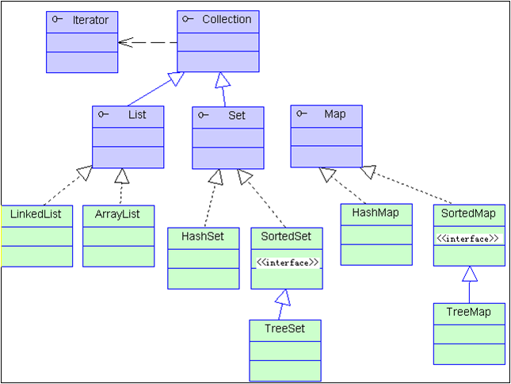
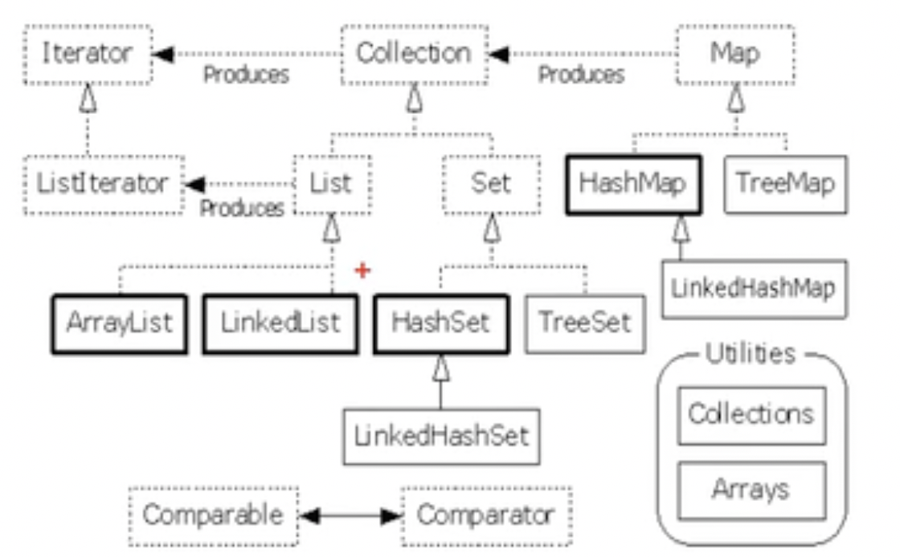

# 面试

## 1. List、Set和Map的理解

1. linked代表链表
2. hash代表hashTable,无序,速度快

速度

链表<二叉树<哈希表

+ List---有序,可重复

  + ArrayList

    数组的顺序表,连续的空间,长度可变的数组

    查快,增删改慢

  + LinkedList

    双向链表的实现,不连续的空间,每个元素指向上一个和下一个元素

    增删改快,查慢

  + Vector

    与ArrayList一致,只是这个是线程安全的(有锁,故效率要低)

+ Set---无序,不可重复

  + HashSet

    底层结构是哈希表

    hashTable(所以无序,不可重复)

    hashTable增删改查都快

  + LinkedHashSet

    使用hash表存储,同时又在hash表上有链表来维护顺序

    所以是有序的

  + TreeSet

    二叉树的红黑树

    有序,查询速度比list快

    但是没有hash表快

+ Map

  + `HashMap`：线程不同步。根据`key`的`hashcode`进行存储，内部使用静态内部类`Node`的数组进行存储，默认初始大小为16，每次扩大一倍。当发生Hash冲突时，采用拉链法（链表）。**可以接受为null的键值\(key\)和值\(value\)**。JDK 1.8中：当单个桶中元素个数大于等于8时，链表实现改为红黑树实现；当元素个数小于6时，变回链表实现。由此来防止hashCode攻击。
+ `LinkedHashMap`：**保存了记录的插入顺序**，在用Iterator遍历LinkedHashMap时，先得到的记录肯定是先插入的. 也可以在构造时用带参数，按照应用次数排序。在遍历的时候会比HashMap慢，不过有种情况例外，当HashMap容量很大，实际数据较少时，遍历起来可能会比LinkedHashMap慢，因为LinkedHashMap的遍历速度只和实际数据有关，和容量无关，而HashMap的遍历速度和他的容量有关。
  + `TreeMap`：线程不同步，基于 **红黑树*- （Red-Black tree）的NavigableMap 实现，**能够把它保存的记录根据键排序,默认是按键值的升序排序，也可以指定排序的比较器，当用Iterator 遍历TreeMap时，得到的记录是排过序的。**
+ `HashTable`：线程安全，HashMap的迭代器\(Iterator\)是`fail-fast`迭代器。**HashTable不能存储NULL的key和value。**
  + `ConcurrentHashmap`：支持并发操作的 Hash 表，`ConcurrentHashmap` 具有和 `HashTable` 同样的功能，并且具有相应的方法。即使所有操作都是线程安全的，但是并不需要进行加锁。

# 集合和数组

数组相对于集合的缺点

+ 数组必须在初始化时定义大小
+ 数组是连续的,插入、更新、删除都需要进行数组的重排
+ 数组的操作缺乏封装

集合的框架结构

# list、set与map

list是可重复,有序

set是不可重复,无序

map的key不可重复,value可重复

# arrayList和LinkedList

arrayList,是顺序表

linkedList,是双向链表

+ List

  有序,可重复

+ ArrayList

  +  顺序表的实现,连续的空间,长度可变的数组
  + 优点:遍历元素和随机访问元素销量高
  + 添加和删除元素效率低,按照内容查询销量慢

+ LinkedList

  + 双向链表的实现,不连续,上一个指向下一个
  + 遍历和随机访问速度慢
  + 插入、删除元素销量高

# HashSet、TreeSet和linkedHashSet

# HashMap和TreeMap LinkedHashMap

# Vector

vector和ArrayList一样,都是基于数组的可变长结构,唯一区别在于其方法加了Synchronized,是线程安全的
